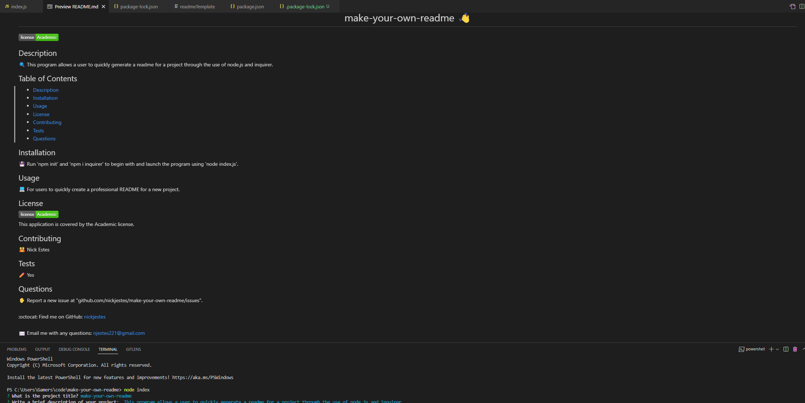

# 📖 Make your own README!

URL: https://nickjestes.github.io/make-your-own-readme/

DEMO VIDEO:
https://user-images.githubusercontent.com/84655404/179863517-ad205178-b3d1-46e5-b10a-f7c3f0182b00.mp4

AS A developer

I WANT a README generator

SO THAT I can quickly create a professional README for a new project

This program allows for the user to use a node.js command in order to create a README file for their projects. The console provides all the necessary questions
and an organized format for a clean final product.

Here is what the final product looks like after running node! The questions/commands are at the bottom in the terminal section.

## Programming Notes

The program had to be initialized using two commands

* npm init
* npm i inquirer

From here the biggest hurdle was figuring out how to format the questions afterward, but there were some outside resources
making that easier.

Writing the code on this was just following the format provided on the inquirer website.(https://www.npmjs.com/package/inquirer)

## 📝 Personal Note

Not sure why installing inquirer creates as many modules as it did, but I'm still glad that it's functional!

